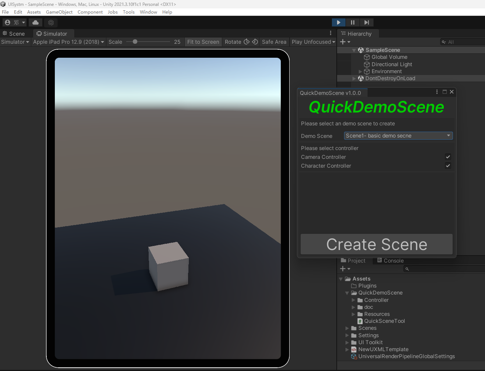
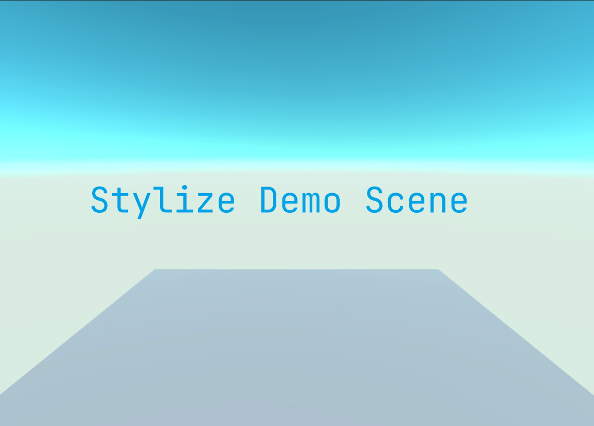

# QScene_ForUnity3d

## version 1.0.1 beta 

------

## A  Unity3d tool for quickly getting a demo scene.

利用本工具可以快速生成一个指定风格的简单示例场景，方便用于测试、教学等场景使用，免去了重复搭建等繁琐操作。

## 如何使用本工具：

-  方式1： Clone仓库到你的项目Asset文件目录下。

- 方式2： 下载Package里的QScene_ToolForUnity.package,双击导入到你的里面项目。成功导入，在你的Unity头部菜单栏上会多出Tools选项，点击选项下的QScene即可使用。

如果报以下错：

`QuickSceneTool.cs(15,29): error CS0234: The type or namespace name 'Universal' does not exist in the namespace 'UnityEngine.Rendering' (are you missing an assembly reference?`

说明你的项目不是URP项目，需要在PackageManager搜索UniversalRP安装，将项目配置成URP项目，等待安装编译完成，报错消失。

## 打开面板

## Tools / QScene

## 快速使用

## Basic cube demo scene

## Features

- [ ] 添加 游戏特效示例背景场景（让用户直接可以在配置好的场景里面专注设计相关特效）
- [ ] 将每个场景选项采用卡片视图显示在面板上，让用户清晰知晓我要创建哪种风格的场景，精准满足应用需求。
- [ ] ...
